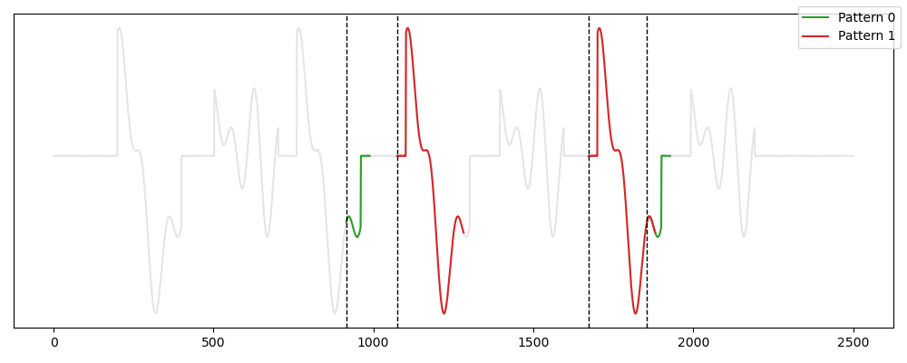
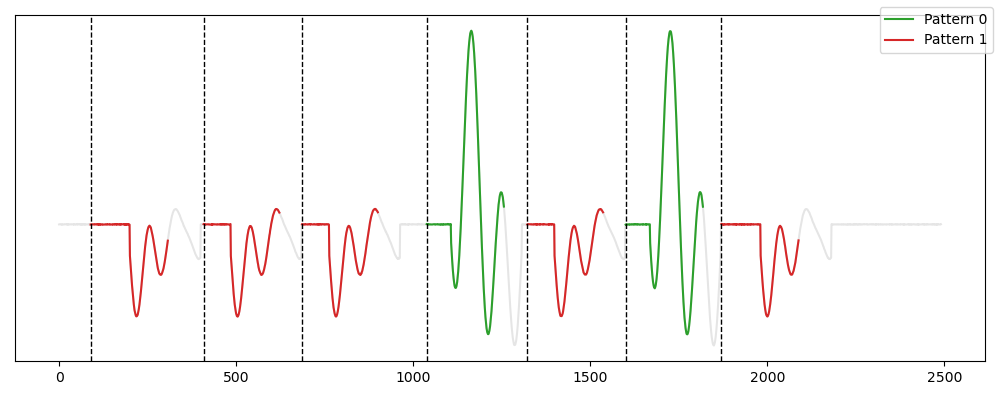
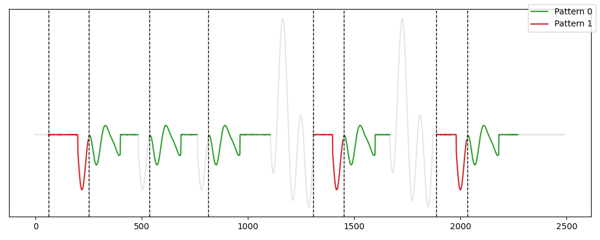

# Encoding-based Algorithms in TSMD

## Grammarviz 

Grammarviz [Senin et al. 2018] uses grammar induction methods for motif detection. In practice, the time series is discretized using SAX, and grammar induction techniques, such as Sequitur or RE-PAIR, are applied to the discretized series to identify grammar rules. The most frequent and representative grammar rules are selected, and occurrences of the various motifs are then extracted.

### Usage

Grammarviz is written in Java and requires a specific setup. Download it from the following GitHub: <https://github.com/GrammarViz2/grammarviz2_src>, place it in TSMD/tsmd/competitors/competitors_tools/, and follow the installation instructions in the repository. You can then use Grammarviz like any other method:


```python
from tsmd.competitors.grammarviz import Grammarviz
from tsmd.tools.utils import transform_label
from tsmd.tools.plotting import plot_signal_pattern


gm=Grammarviz(n_patterns=2)
gm.fit(signal)

labels=transform_label(gm.prediction_mask_)
plot_signal_pattern(signal,labels)
```
```

```

### Reference

[Senin et al. 2018] Pavel Senin, Jessica Lin, Xing Wang, Tim Oates, Sunil Gandhi, Arnold P Boedi-hardjo, Crystal Chen, and Susan Frankenstein. 2018. Grammarviz 3.0: Interactive discovery of variable-length time series patterns. ACM Transactions on Knowledge Discovery from Data (TKDD)12, 1 (2018), 1–28

## MDL-Clust

The MDL-CLust method [Rakthanmanon et al. 2012] aims to perform clustering of subsequences. However, since clustering time series subsequences is generally ineffective, the authors propose disregarding data that does not fit into any cluster and avoiding overlapping subsequences. Thus, the output of MDL-CLust can be fully interpreted as motif sets. 
More specifically, the method utilizes the MDL principle to form clusters. In each iteration, we can either create a new cluster (by selecting the first two members using a classic PairMotif algorithm), add a subsequence to an existing cluster, or merge two clusters. We select the operation that most effectively reduces the description length. The algorithm terminates when no usable data remains or further reduction in the time series description length is no longer possible.

```{eval-rst}  
.. autoclass:: tsmd.competitors.mdl.MDL
    :members:

```

### Usage

```python
from tsmd.competitors.mdl import MDL
from tsmd.tools.utils import transform_label
from tsmd.tools.plotting import plot_signal_pattern


mdl=MDL(min_wlen=180,max_wlen=220)
mdl.fit(signal)

labels=transform_label(mdl.prediction_mask_)
plot_signal_pattern(signal,labels)
```




### Reference

[Rakthanmanon et al. 2012] Thanawin Rakthanmanon, Eamonn J Keogh, Stefano Lonardi, and Scott Evans.2012. MDL-based time series clustering. Knowledge and information systems 33(2012), 371–399.

## LoCoMotif 

The LoCoMotif method [Wesenbeeck et al. 2024] addresses the challenge of variable length by searching for time-warped motifs at potentially different time scales within a time series. The process begins with the LoCo step, where the Self-Similarity Matrix of the time series is utilized to construct paths based on a principle similar to Dynamic Time Warping (DTW). The paths with the highest accumulated similarity in this matrix are identified. In the second step, these subpaths are grouped to create candidate Motifs. The method then assesses the encoding capacity of these candidates using a quality score that combines the similarity between occurrences with the overall coverage of the Motif set.

```{eval-rst}  
.. autoclass:: tsmd.competitors.locomotif.LocoMotif
    :members:

```

### Usage

```python
from tsmd.competitors.locomotif import LocoMotif
from tsmd.tools.utils import transform_label
from tsmd.tools.plotting import plot_signal_pattern


loco=LocoMotif(n_patterns=2, min_wlen = 180, max_wlen =220)
loco.fit(signal)

labels=transform_label(loco.prediction_mask_)
plot_signal_pattern(signal,labels)
```



### Reference

[Wesenbeeck et al. 2024] Daan Van Wesenbeeck, Aras Yurtman, Wannes Meert, and Hendrik Blockeel.2024. LoCoMotif: Discovering time-warped motifs in time series.Data Mining and Knowledge Discovery (2024), 1–30.
