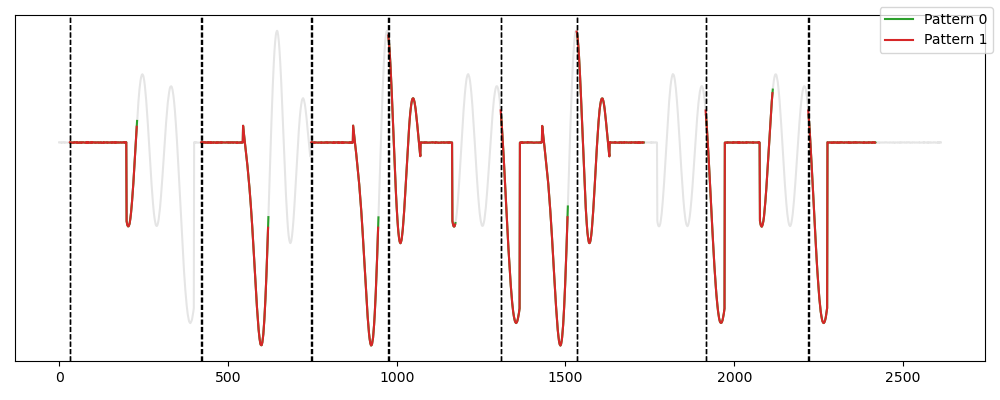
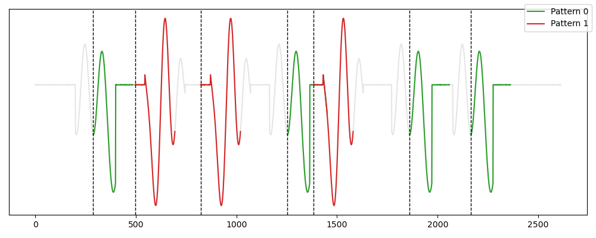

# Frequency-based Algorithms in TSMD

## SetFinder

This algorithm [Bagnall et al. 2014] finds the K-motif sets directly, based on a counting and separating principle. In practice, each subsequence is compared to every other, and the non-overlapping matches  are counted. Then, each subsequence with a non-zero count is checked to ensure that its distance to another subsequence with a larger number of matches is greater than a given threshold.

```{eval-rst}  
.. autoclass:: tsmd.competitors.setfinder.Baseline
    :members:

```

### Usage

```python
from tsmd.competitors.setfinder import Baseline
from tsmd.tools.utils import transform_label
from tsmd.tools.plotting import plot_signal_pattern


sf=Baseline(n_patterns=2, radius = 1, wlen = 200, distance_name='UnitEuclidean')
sf.fit(signal)

labels=transform_label(sf.prediction_mask_)
plot_signal_pattern(signal,labels)
```




### Reference

[Bagnall et al. 2014] Anthony Bagnall, Jon Hills, and Jason Lines. 2014.  Finding motif sets in time series.arXiv preprint arXiv:1407.3685(2014).


## LatentMotif

This method [Grabocka et al. 2016] addresses a variant of the K-Motifs problem as a constrained optimization task, where the center of the motif is learned (the center doesn't need to be a subsequence of $S$ but can belong to any element in $\mathbb{R}^n$). The initial objective and constraint functions are regularized to enable gradient ascent. The learned subsequences are then returned as the centers of the motif sets. To identify all occurrences of each motif set, a complete scan of the time series subsequences is conducted. Non-overlapping subsequences within a distance $R$ of the learned center are considered occurrences of the motif set.


```{eval-rst}  
.. autoclass:: tsmd.competitors.latentmotifs.LatentMotif
    :members:

```

### Usage

```python
from tsmd.competitors.latentmotifs import LatentMotif
from tsmd.tools.utils import transform_label
from tsmd.tools.plotting import plot_signal_pattern


lm=LatentMotif(n_patterns=2, radius = 10, wlen = 200)
lm.fit(signal)

labels=transform_label(lm.prediction_mask_)
plot_signal_pattern(signal,labels)
```




### Reference

[Grabocka et al. 2016] Josif Grabocka, Nicolas Schilling, and Lars Schmidt-Thieme. 2016. Latent time-series motifs. ACM Transactions on Knowledge Discovery from Data (TKDD)11, 1(2016), 1–20.
