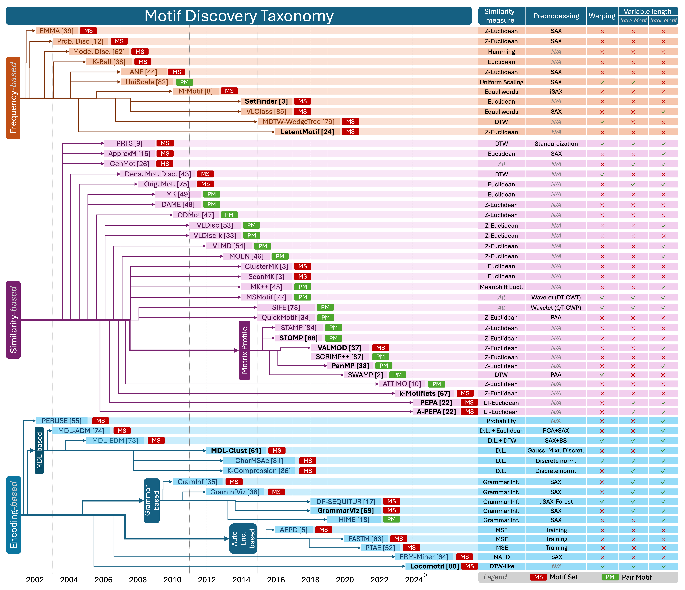

# A Process-centric Taxonomy

As mentioned above, Motif Discovery has attracted considerable academic attention, and various methods have been proposed. 
However, the methods proposed in the literature differ in terms of the definition of motif considered. 
In addition, we also observe significant differences in terms of methodology and challenges they attempt to address. 
Therefore, we propose a process-centric taxonomy of Motif Discovery methods. Overall, we highlight three prominent families: 
(i) **Frequency-based**, (ii) **Similarity-based**, and (iii) **Encoding-based**. We depict our taxonomy in the figure below and detail each family below.

## Frequency-based Methods

> *The frequency-based methods aim at identifying sets of subsequences that represent the most frequently repeated patterns.*

Many methods in this family take a radius $R$ as a parameter and try to find the set of non-overlapping subsequences of 
maximum cardinality that fit within a circle of radius $R$. Some methods with a prior discretization step make use of the fact 
that in a discretized time series, the exact repetitions of an element can be counted to return the exactly repeating elements 
with the highest cardinality.

## Similarity-based Methods

> *The Similarity-based methods aim at identifying a set of subsequences with minimum distance between occurrences independently 
of the number of occurrences in the set.*

This is particularly true for all methods that rank the relevance of a 
Motif based on the minimum pairwise distance between two occurrences. 
Pair Motif is the extreme case where Motif Sets are composed only of the two closer nonoverlapping subsequences. 
Building on Pair Motifs algorithms, some Motif Set algorithms first find Pair Motifs and construct the Motif 
Set around the Pair Motifs. Motifs can also be ranked based on other proximity criteria, such as the maximum 
pairwise distance of a set of occurrences given a fixed number of occurrences.

## Encoding-based Methods

> *The Encoding-based algorithms aim at identifying a set of subsequences that represent the best way to encode the time series according to different criteria.*

In the literature, we find 3 main ways of encoding time series to find motifs: by using information theory and the Minimum Description Length (MDL) 
principle to rank the capacity of motifs to encode a time series, by using Grammar Inference algorithms in which motifs are seen as grammar rules 
and their occurrences as instances of the rules, 
by training AutoEncoders to reconstruct the time series with a minimum number of motifs.
