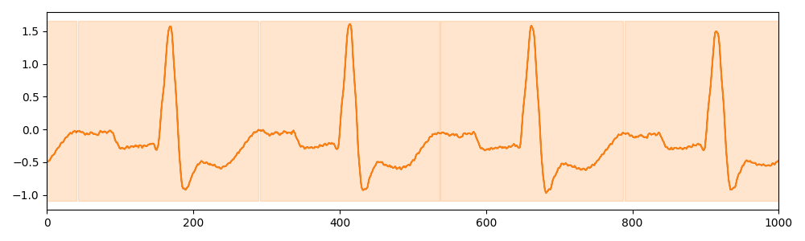

# MITDB

We randomly selected 100 one-minute time series from the MIT-BIH dataset [Goldberger et al. 2000] (healthy subjects or not). Each time series has 1 to 4 motifs (normal heartbeats and different types of arrhythmia), each with several occurrences.

## Example of Time series (snippet)

## Meta-data summary

- number of motifs: 10
- mean number of motifs per time series: 1.63
- min number of motifs per time series: 1
- max number of motifs per time series: 4

## Reference

[Goldberger et al. 2000] Ary L Goldberger, Luis AN Amaral, Leon Glass, Jeffrey M Hausdorff, Plamen Ch Ivanov, Roger G Mark, Joseph E Mietus, George B Moody, Chung-Kang Peng, and H Eugene Stanley. 2000. PhysioBank, PhysioToolkit, and PhysioNet: components of a new research resource for complex physiologic signals. circulation 101, 23(2000), e215–e220.
