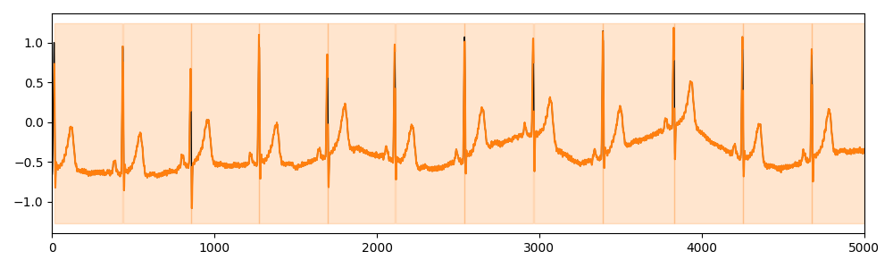

# MITDB1 

The MIT-BIH Arrhythmia Database [Goldberger et al. 2000] contains 48 half-hour recordings of two-channel ambulatory electrocardiograms (ECGs) sampled at 360Hz. Cardiologists annotated the heartbeats according to 19 categories. We divide all recordings into a time series of 1 minute and keep only the first channel. We selected time series of healthy subjects that contains only normal heartbeats and randomly selected 100 time series.

## Example of Time series (snippet of 5000 points)

## Meta-data summary

- number of motifs: 1
- mean number of motifs per time series: 1
- min number of motifs per time series: 1
- max number of motifs per time series: 1

## Reference

[Goldberger et al. 2000] Ary L Goldberger, Luis AN Amaral, Leon Glass, Jeffrey M Hausdorff, Plamen Ch Ivanov, Roger G Mark, Joseph E Mietus, George B Moody, Chung-Kang Peng, and H Eugene Stanley. 2000. PhysioBank, PhysioToolkit, and PhysioNet: components of a new research resource for complex physiologic signals. circulation 101, 23(2000), e215–e220.
