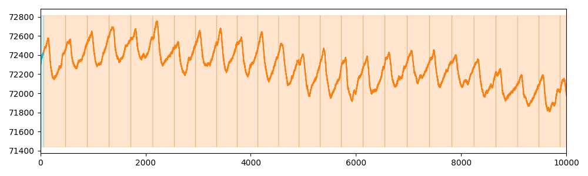

# ptt-ppg

Pule-Transit-Time photoplethysmogram (PPG) dataset [Mehrgardt et al. 2022] consists of time series recorded with multiple sensors (sampled at 500Hz) from healthy subjects performing physical activities. The annotated motifs are heartbeats. We randomly select 100 40-second-long signals from the first channel of the PPG during the “run” activity.

## Example of Time series (snippet)

## Meta-data summary

- number of motifs: 1
- mean number of motifs per time series: 1
- min number of motifs per time series: 1
- max number of motifs per time series: 1

## Reference

[Mehrgardt et al. 2022] Philip Mehrgardt, Matloob Khushi, Simon Poon, and Anusha Withana. 2022. Pulse Transit Time PPG Dataset. PhysioNet10 (2022), e215–e220
