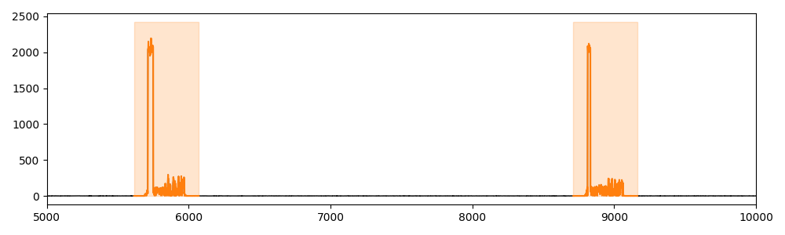

# REFIT

This dataset [Murray et al. 2017] provides aggregate and individual appliance load curves at 8-second sampling intervals from 20 houses. We selected 10 houses and aggregated recordings of the appliances available: dishwasher, washing machine, and tumble dryer. The recordings were down-sampled to 32-second intervals and divided into time series of one week. We kept 10 time series for each house in which the appliances were not used simultaneously. It resulted in a 100 univariate time series dataset with a maximum of 3 different motifs.

## Example of Time series (snippet)

## Meta-data summary

- number of motifs: 3
- mean number of motifs per time series: 2.24
- min number of motifs per time series: 1
- max number of motifs per time series: 3

## Reference

[Murray et al. 2017] David Murray, Lina Stankovic, and Vladimir Stankovic. 2017. An electricalload measurements dataset of United Kingdom households from a two-year longitudinal study. Scientific data 4, 1 (2017), 1–12.
