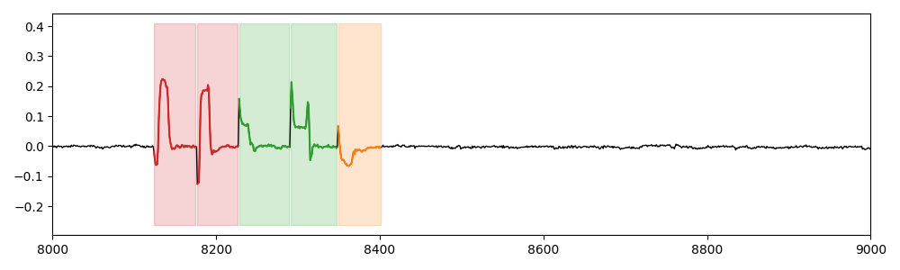

# SIGN

This dataset [Kadous 2017] is built from samples of Auslan (Australian Sign Language) signs. 95 signs were collected from five signers, totaling 6650 sign samples. Based on this, we generate a long time series by injecting several words (concatenation of signs). The different injected signs are the motifs. Every word is separated with flat sequences (i.e., without any motifs). In total, we generate 50 different time series.

## Example of Time series (snippet)

## Meta-data summary

- number of motifs: 3
- mean number of motifs per time series: 3
- min number of motifs per time series: 3
- max number of motifs per time series: 3

## Reference

[Kadous 2017] Mohammed Kadous. 1995. Australian Sign Language Signs. UCI Machine Learning Repository.  DOI: https://doi.org/10.24432/C5XG6C.
