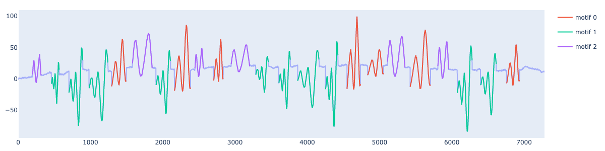
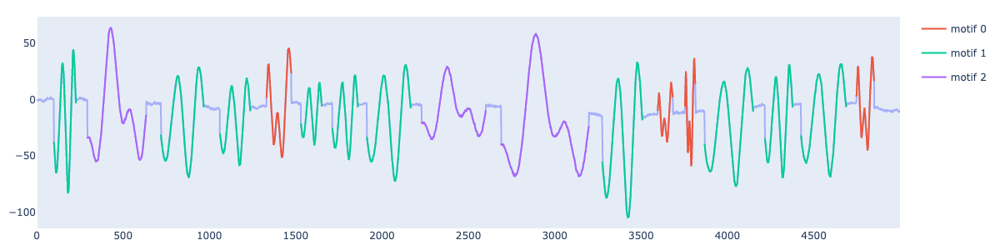

# Synthetic Generator

This section introduces the synthetic time series generator used to produce data for investigating research questions 2 to 6.

```{eval-rst}  
.. autoclass:: data.Synthetic.synthetic_signal.SignalGenerator
    :members:
```

## Usage 

### Example 1 (Motifs of same average size, number of occurences randomly selected within an interval)
```python
from data.Synthetic.synthetic_signal import SignalGenerator

generator=SignalGenerator(n_motifs=3, motif_length=200, motif_amplitude=2, motif_fundamental=3, 
                           noise_amplitude = 0.5, length_fluctuation=0.5, amplitude_fluctuation=0.5,
                           sparsity=0.5, sparsity_fluctuation=0.5, walk_amplitude=0.2, 
                           min_rep=5, max_rep=10)
signal,labels= generator.generate()
generator.plot()
```


### Example 2 (Motifs of different average size, fixed number of occurences and total time series length)

```python
generator=SignalGenerator(n_motifs=3, motif_length=[100,200,500], motif_amplitude=2, motif_fundamental=3, 
                        noise_amplitude = 0.5, length_fluctuation=0.5, amplitude_fluctuation=0.5,
                        sparsity=0.5, sparsity_fluctuation=0.5, walk_amplitude=0.2, 
                        exact_occurences=[4,10,3],exact_ts_length=5000)
signal,labels= generator.generate()
generator.plot()
```



