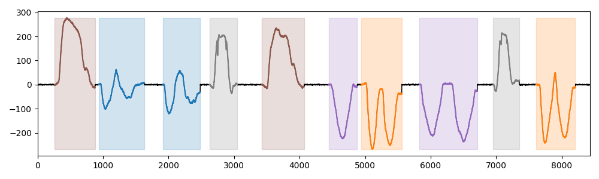

# arm-CODA 

It is a dataset of 240 multivariate time series collected using 34 Cartesian Optoelectronic Dynamic Anthropometers (CODA) placed on the upper limbs of 16 healthy subjects, each of whom performed 15 predefined movements [Combettes et al. 2024]. Each sensor records its position in 3D space. To construct the dataset, we kept the left forearm sensor of ID 29 and 5 of the predefined movements. The occurrences of the five movements were randomly placed along the time axis for each subject, sensor, and dimension. Gaussian noise with a signal-to-noise ratio of 0.01 is added to all time series. This resulted in a dataset of 64 univariate time series.

## Example of Time series

## Meta-data summary

- number of motifs: 7
- mean number of motifs per time series: 5
- min number of motifs per time series: 5
- max number of motifs per time series: 5

## Reference

[Combettes et al. 2024] Sylvain W. Combettes, Paul Boniol, Antoine Mazarguil, Danping Wang, Diego Vaquero-Ramos, Marion Chauveau, Laurent Oudre, Nicolas Vayatis, Pierre-Paul Vidal, Alexandra Roren, and Marie-Martine Lefèvre-Colau. 2024. Arm-CODA: A Data Set of Upper-limb Human Movement During Routine Examination. Image Processing On Line 14 (2024), 1–13
