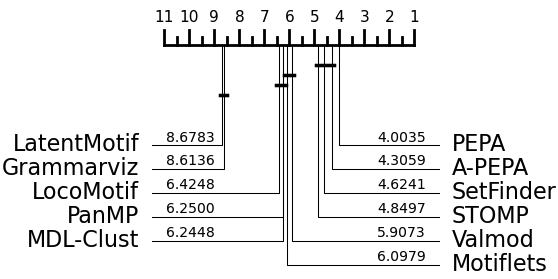
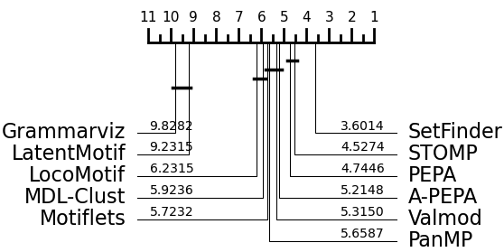

# RQ1 : Performances on real data

*Are there any methods that stand out from the rest in terms of performance on real data datasets?*

To answer this question, we measure the performances (both in terms of f1-score and execution time) of the selected Motif Discovery methods on our collection of real labeled time series.

Our evaluation is summarized in the table below (the empty cells correspond to methods that crashed or reached our time-out defined in the previous section ). We also present critical difference diagrams, with and without REFIT and SIGN, showing the average rank of each method over the entire dataset. The dark lines represent cliques of methods with broadly similar performance, found using pairwise Wilcoxon tests. 

## Summary of the results

| Dataset       | Metric     | **STOMP**         | **PanMP**         | **LoCoMotif**    | **LatentMotif**  | **MDL-Clust**    | **k‑Motiflets**  | **PEPA**         | **VALMOD**       | **SetFinder**     | **A‑PEPA**        | **GrammarViz**    |
|---------------|------------|-------------------|-------------------|------------------|------------------|------------------|------------------|------------------|------------------|-------------------|-------------------|-------------------|
| **arm-coda**  | fscore     | 0.25 (0.15)       | 0.22 (0.10)       | 0.17 (0.17)      | 0.27 (0.14)      | **0.66** (0.25)  | 0.03 (0.07)      | _0.29_ (0.14)    | _0.29_ (0.15)    | 0.20 (0.05)       | _0.29_ (0.17)     | 0.01 (0.02)       |
|               | Exec. time | _0.5_ (0.06)      | 170 (63)          | 18 (8)           | 30 (9)           | 555 (159)        | 154 (42)         | 2 (0.3)          | 303 (80)         | 1.5 (0.5)         | 2 (0.3)           | **0.3** (0.00)    |
| **mitdb**     | fscore     | 0.50 (0.20)       | 0.14 (0.22)       | 0.12 (0.18)      | 0.29 (0.24)      | 0.33 (0.15)      | 0.40 (0.37)      | 0.41 (0.30)      | 0.17 (0.23)      | **0.55** (0.17)   | _0.51_ (0.19)     | 0.00 (0.00)       |
|               | Exec. time | _2.9_ (0.01)      | 934 (600)         | 1252 (3837)      | 14 (8)           | 4178 (1483)      | 16396 (10413)    | 11 (0.4)         | 1762 (1273)      | 14 (2.3)          | 11 (0.4)          | **0.41** (0.02)   |
| **mitdb1**    | fscore     | 0.63 (0.19)       | _0.69_ (0.26)     | 0.29 (0.14)      | 0.14 (0.14)      | 0.18 (0.07)      | 0.44 (0.37)      | 0.46 (0.34)      | 0.66 (0.25)      | **0.77** (0.10)   | 0.36 (0.20)       | 0.00 (0.00)       |
|               | Exec. time | _3_ (0.05)        | 187 (105)         | 76 (8)           | 7 (1.5)          | 1133 (254)       | 3157 (1918)      | 11 (0.5)         | 156 (48)         | 12 (1.2)          | 10 (0.5)          | **0.42** (0.02)   |
| **ptt-ppg**   | fscore     | 0.49 (0.18)       | 0.53 (0.23)       | 0.38 (0.16)      | 0.27 (0.17)      | 0.18 (0.07)      | 0.61 (0.26)      | _0.68_ (0.12)    | 0.54 (0.23)      | **0.69** (0.05)   | 0.43 (0.16)       | 0.00 (0.01)       |
|               | Exec. time | _3_ (0.6)         | 270 (200)         | 102 (17)         | 8 (2.8)          | 1261 (279)       | 4598 (2630)      | 11 (0.2)         | 204 (86)         | 23 (3)            | 12 (1.4)          | **0.4** (0.02)    |
| **JIGSAWMaster** | fscore  | _0.26_ (0.10)     | 0.10 (0.12)       | **0.33** (0.10)  | 0.26 (0.12)      | 0.23 (0.08)      | 0.13 (0.08)      | 0.18 (0.09)      | 0.17 (0.09)      | 0.23 (0.04)       | 0.20 (0.09)       | 0.10 (0.05)       |
|               | Exec. time | _0.9_ (0.8)       | 420 (520)         | 318 (665)        | 7 (6)            | 2214 (2147)      | 660 (669)        | 4 (3)            | 1208 (1038)      | 5 (5)             | 4 (3)             | **0.31** (0.04)   |
| **JIGSAWSlave**  | fscore  | _0.25_ (0.12)     | 0.05 (0.07)       | **0.33** (0.12)  | 0.24 (0.10)      | 0.23 (0.06)      | 0.15 (0.10)      | 0.17 (0.08)      | 0.20 (0.10)      | 0.22 (0.05)       | 0.18 (0.08)       | 0.10 (0.06)       |
|               | Exec. time | _0.87_ (0.68)    | 343 (300)         | 189 (267)        | 6 (4)            | 2005 (1812)      | 590 (512)        | 4 (3)            | 1453 (1459)      | 4.7 (4)           | 4 (2)             | **0.31** (0.03)   |
| **REFIT**     | fscore     | 0.00 (0.03)       | –                 | –                | 0.03 (0.08)      | –                | –                | _0.14_ (0.12)    | –                | –                 | **0.16** (0.15)   | 0.00 (0.00)       |
|               | Exec. time | 500 (96)          | –                 | –                | _230_ (122)      | –                | –                | 1280 (100)       | –                | –                 | 1310 (120)        | **63** (12)       |
| **SIGN**      | fscore     | 0.06 (0.04)       | –                 | –                | 0.14 (0.09)      | –                | –                | 0.17 (0.03)      | –                | –                 | **0.20** (0.06)   | _0.10_ (0.07)     |
|               | Exec. time | 300 (25)          | –                 | –                | _50_ (10)        | –                | –                | 900 (85)         | –                | –                 | 900 (88)         | **5** (18)        |

## Critical diagram with REFIT and SIGN 

## Critical diagram without REFIT and SIGN

## * **RQ1 Conclusion:** 

PEPA, A-PEPA, STOMP and SetFinder seem to have slightly better results on real data, according to critical diference diagrams. However, the variations in methods performances between the dataset show the importance of asking precise questions about which time series characteristics influence the performance of the algorithms.
Thus, in the following sections, we benefit from our synthetic generator in identifying specific challenges.*