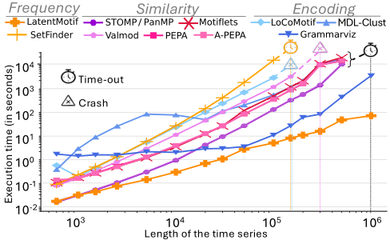

# RQ2: Scalability for long time-series

** Are the methods capable of solving the problem in a reasonable amount of time for a relatively long time series ? ** 

To answer this question, we measure the influence of the length of the time series on the execution time of the methods.

Our evaluation is summerized in the plot below.

## Summary of the results

## RQ2 Conclusion

Grammarviz and LatentMotif are the most scalable methods in terms of computational efficiency for handling long time series. STOMP, PanMP, MDL-Clust, PEPA, and A-PEPA have acceptable execution times up to 500,000 samples, while the other methods crash or exceed the timeout before that.