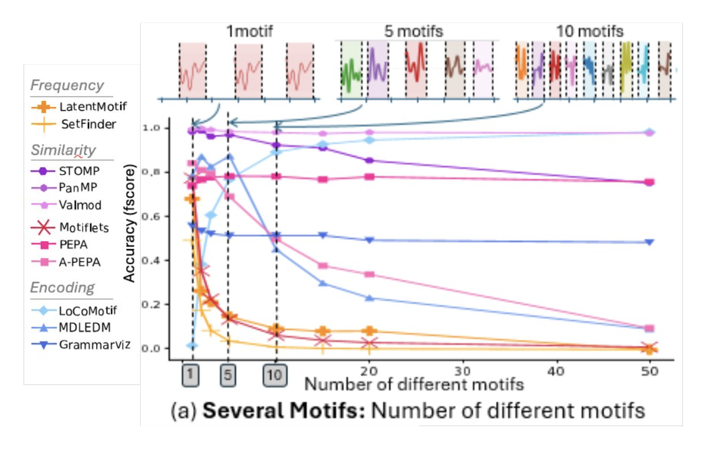

# RQ3: Presence of several different motifs

*Are the methods robust to a high number of different motifs?*

In this section, we evaluate the robustness of methods to a variation of the number of different motifs.
Our evaluation is summarized in the plot below.

## Summary of the results

## RQ3 Conclusion

VALMOD, PEPA, and Grammarviz are particularly robust to the number of motifs. In addition, Locomotif has good performances for a large number of motifs.
However, all of these algorithms require the number of motifs $K$ as input.