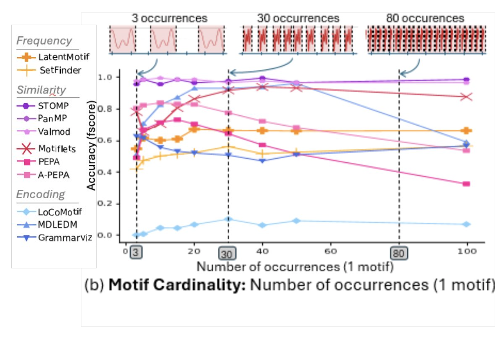
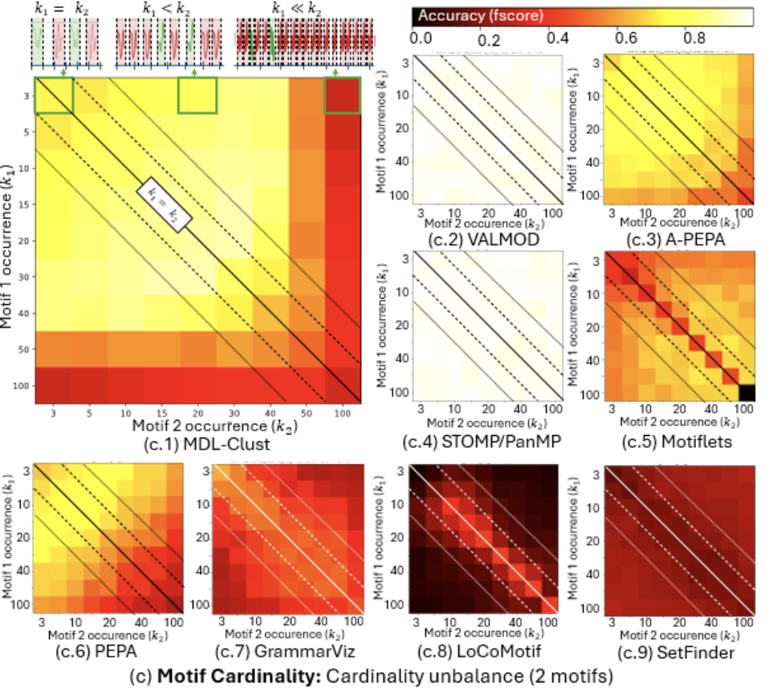

# RQ4 : Motifs cardinality

## RQ4.1 
*Are the methods capable of finding all occurrences of the most relevant motifs independently of their cardinality?*

In this section, we evaluate the ability of methods to detect the occurrence of motifs with different cardinalities.
Our evaluation is summarized in the plot below.

### Summary of the results

### RQ4.1 Conclusion

VALMOD, PanMP, STOMP, Grammarviz, LatentMotif and SetFinder are particularly robust to the number of occurrences. Motiflets has good performances when motifs sets have many occurences.

## RQ4.2
*Are the methods capable of detecting several motifs when there is a cardinality unbalance?*

In this section, we evaluate the impact of an unbalanced cardinality between different motifs, i.e., a difference in the number of occurrences between two different motifs.
Our evaluation is summarized in the figure below, which depicts the average f1score on 100 runs for several methods . The diagonal corresponds to cases where the two motifs have the same number of occurrences. 

### Summary of the results

### RQ4.2 Conclusion

VALMOD, STOMP, and PanMP are particularly robust to unbalanced cardinality of motif sets.