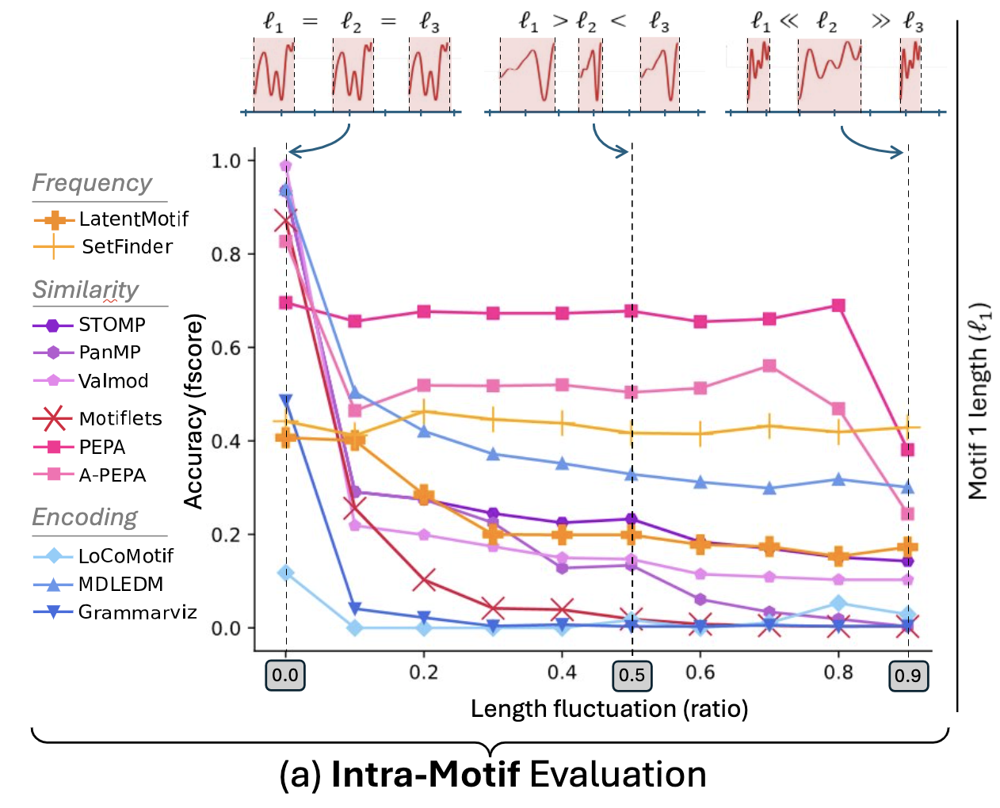
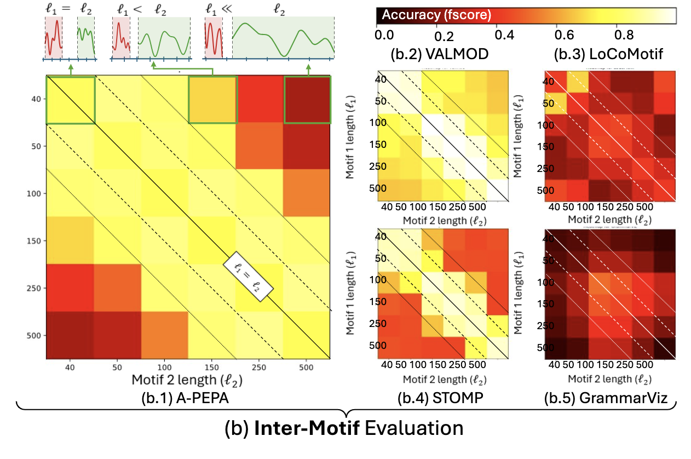

# RQ5 : Variable length

## RQ5.1 
*Are the methods robust to the presence of an Intra-Motif variable length due to temporal deformations of the initial motif ?*

In this section, we evaluate the robustness of methods to the presence of an Intra-Motif variable length due to temporal deformations of the initial motif.
Our evaluation is summarized in the plot below.

### Summary of the results

### RQ5.1 Conclusion

PEPA is the most robust method to length variation, followed by A-PEPA and SetFinder. The latter maintains a constant performance, although not as high as the two others.

## RQ5.2
*Are the methods able to detect motifs of different timescales?*

In this section, we evaluate the methods' ability to detect motifs present at different time scales, meaning that motifs with different average lengths represent different time scales (e.g. one second or one minute).
Our evaluation is summarized in the figure below, which depicts the average f1score on 100 runs for each method and a combination of average lengths. The diagonal corresponds to cases in which the two motifs have the same length.

### Summary of the results

### RQ5.2 Conclusion

MDL-Clust, STOMP and Motiflets are the most suitable methods for small timescale variations between motifs. Only PEPA, A-PEPA and VALMOD maintain relatively good performance as soon as the scale variation increase. Overall, only VALMOD maintains good performance for extreme cases.