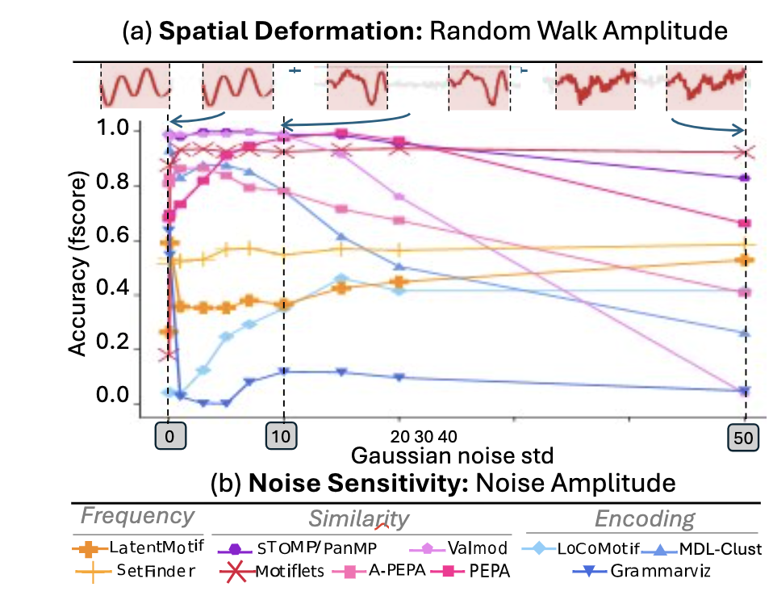
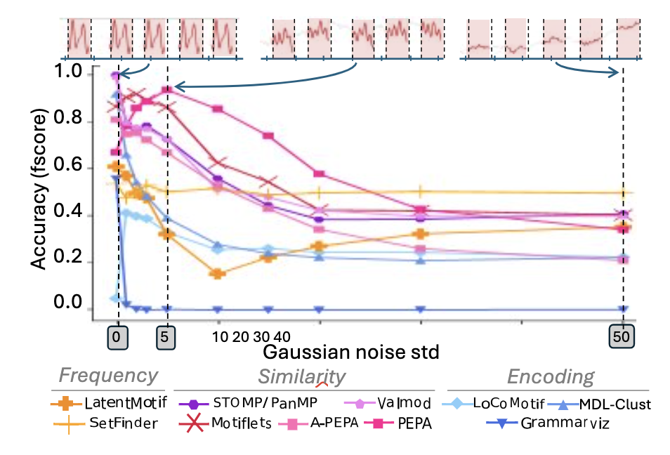

# RQ6 : Spatial deformations 

## RQ6.1 
*Are the methods robust to linear trends in the time series ?*

In this section, we evaluate the robustness of methods to the presence of linear trends of different amplitudes.
Our evaluation is summarized in the plot below.

### Summary of the results

### RQ6.1 Conclusion

SetFinder shows consistent performances in the presence of random walk. Motiflets, PEPA, and LoCoMotif maintain correct performance even for high random walk amplitudes.

## RQ6.2
*Are the methods robust to noise in the time series ?*

In this section, we evaluate the robustness of methods to noise.
Our evaluation is summarized in the plot below.

### Summary of the results

### RQ6.2 Conclusion

STOMP, PANMP, and Motiflets are the most suitable for very noisy time series. If the noise is non-zero without being excessively high, one can also consider using VALMOD or PEPA.