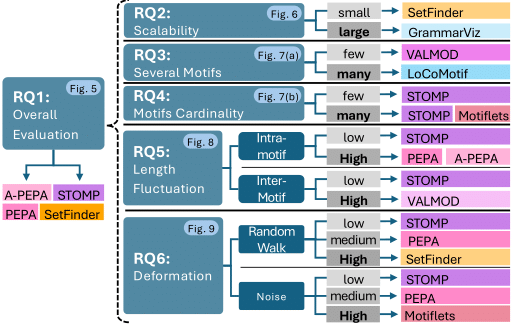

# Guidelines 

While some methods (e.g., PEPA, A-PEPA, STOMP, SETFINDER) show better overall performance on real data, no single method can address all challenges effectively. Performance largely depends on the specific characteristics of the time series.
To move beyond this broad conclusion, we designed experiments to isolate and measure the impact of individual time series characteristics. Our findings address six key research questions and provide guidelines to help users select the most suitable method for their needs: 

