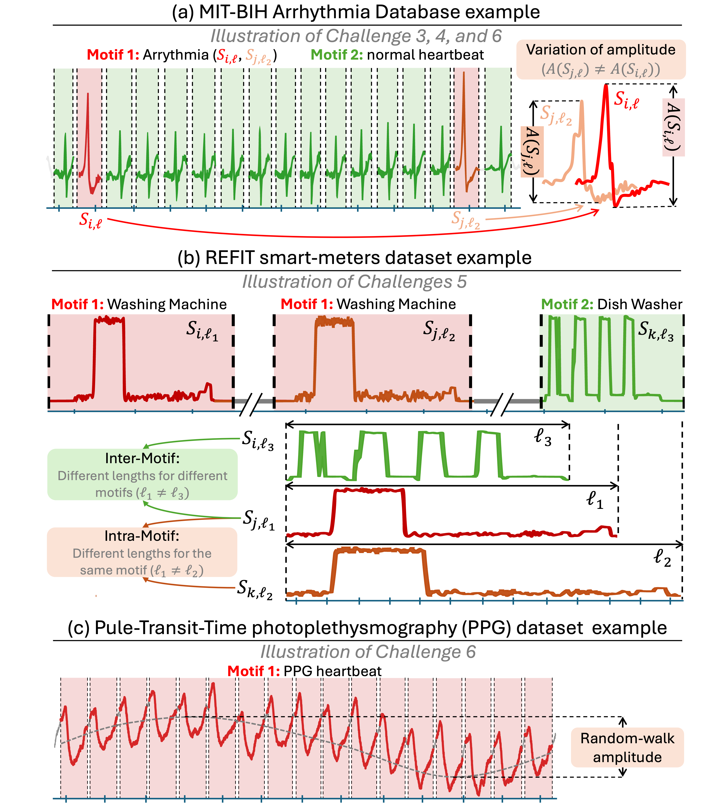

# Motif Discovery in Practice

Beyond the different problem formulations, the literature is structured around several practical challenges faced when applying methods to real-world data. In theory, the proposed methods have addressed these challenges in different ways. However, there has never been a comprehensive study comparing the methods in terms of their practical effectiveness in addressing these challenges. Below, we list the most important Motif Discovery challenges relevant to real-world applications and some hints on how they have been dealt with in theory. 

## Practical Challenges

### Challenge 1: *Performances on real data* 

Practitionners generally want to find patterns representing interpretable temporal events in real-life applications. The first challenge is, therefore, to have a model that is generic enough to detect such temporal events, which is characterized by good performance on expert-labeled data. 

### Challenge 2: *Scalability for long time series*

The Motif Discovery task is computationally expensive. Indeed, the time complexities of the methods are generally quadratic in the length of the time series. A significant challenge lies in the scalability of the algorithms. This problem has been addressed in different ways, for example, by solving computationally tenable subproblems such as the Pair Motif Problem.

### Challenge 3: *Presence of several different motifs*

Time series can either contain one or several different motifs.
The presence of a large number of motifs is a major challenge, as the methods must not only detect the occurrences, but also group them together. This problem has been dealt with by searching for the $K$ best motifs and not only the best one. The number of motifs can be a user-given parameter or found by some heuristics.

### Challenge 4: *Motifs cardinality*

The cardinality of a motif refers to its number of occurrences. Motifs can have variable cardinalities and, therefore, be more or less rare. Moreover, there may also be imbalances between the cardinalities of different patterns when there are several motifs in the time series. The cardinality of patterns represents a real challenge since some approaches prioritize the most frequent patterns, while others prioritize patterns containing the closest occurrences, independently of cardinality.

### Challenge 5: *Variable length*

Variations in motif length pose a significant challenge in time series analysis. These variations can occur within the same motif due to deformations, expansions, or contractions, a phenomenon known as time warping. This is known as **intra-motif** variability.
This issue is commonly addressed using elastic distance measures based on Dynamic Time Warping (DTW). Other approaches allow motifs to have different lengths by merging overlapping occurrences or by collapsing successive identical symbols in discretized time series. Length variations can also result from the presence of multiple motifs with different average lengths, known as **inter-motif** variability. For example, in electrical consumption time series, motifs can appear on an hourly or daily scale. This variability complicates the comparison of motifs relevance when they have different average lengths. To address this, several methods propose heuristics to determine optimal motif lengths, use grammar rules without predefined lengths, or enumerate motif occurrences over a range of window lengths for comparison.

### Challenge 6: *Spatial deformations*

Occurrences of the same motif can be affected by deformations such as amplitude scaling, offset shifts, linear trends, and noise. These variations pose a challenge, as classical distances like Euclidean distance do not account for all these factors. Z-normalized Euclidean distance was introduced to handle amplitude variations and offset shifts by normalizing subsequences' standard deviations and means, effectively solving this issue. However, linear trends have received little attention in the literature. A recent advancement, LT-normalized Euclidean distance, extends Z-normalization to address this challenge.   Noise is typically managed implicitly through distance and similarity measures that allow some variability in the motifs sets.
