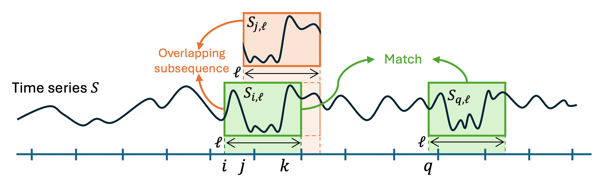

# Introduction

Time Series are prevalent in many scientific and industrial domains. Formally, a time series is a sequence of time-ordered real-valued samples. The samples can correspond to different physical quantities, such as temperature and pressure, electricity consumption, or human pose. Several tasks have emerged from the growing desire to analyze time series like classification, clustering, anomaly detection, and Motif Discovery. The latter involves discovering recurring patterns, known as motifs, within a time series. Beneficial for explanatory purposes, this task can also be a first step toward subsequent analysis. For instance, classification or clustering of long-time series may be impractical but can be simplified by extracting representative features, such as motifs. Such motifs usually represent temporal events, such as heartbeats in an electrocardiogram or the electrical consumption of an appliance in a smart-meter series. 

## Motif Discovery: A Brief History

Motif Discovery in real-valued time series implies identifying similar subsequences (representing a specific pattern or motif) within the time series [Lin et al. 2002]. Before the formal introduction of Motif Discovery, most of the research studies focused on the problem of identifying already known patterns (also referred to as query by content) [Agrawal et al. 1993], or in identifying patterns (or motifs) in discrete time series, in particular in computational biology, which had a strong influence in the early real-valued time series Motif Discovery literature. 

Indeed, inspired by the work in computational biology, Motif Discovery in real-valued time series has been first tackled by proposing methods with a preprocessing step of discretizing time series [Lin et al. 2002]. 
These methods directly search for patterns in the discretized series, which reduces computation times but only provides approximated solutions. Toward exact results in a reasonable time, many papers have focused on the simplified but well-posed problem named Best Motif Pair, which consists of finding the subsequence pairs with minimum distances under some non-overlapping conditions [Yeh et al. 2016]

Overall, in the two last decades, we observe several key moments in the resolution of the Motif Discovery problem: (i) The introduction of the general problem in 2002 [Lin et al. 2002], (ii) the proposal of the first algorithm to solve the Motif Pair problem exactly in 2009 [Mueen et al. 2009], (iii) the use of grammar-based techniques on the discretized time series in 2010 [Li et al. 2010], and (iv) the introduction of Matrix Profile in 2016 [Yeh et al. 2016], which resulted in significantly reducing execution time and on which many of the latest Motif Discovery algorithms are based.

More recently, several Motif Discovery methods [Schäfer et al. 2022] were introduced to solve the Motif Set problem. These methods aim to maintain reasonable scalability without using a discretization step, which is potentially difficult to calibrate. Finally, it is interesting to note the recent emergence of auto-encoder methods for Motif Discovery [Bascol et al. 2016]. However, unlike all the other methods mentioned above, a training phase is necessary, limiting their applications to use cases with a large set of time series at our disposal.

## Time Series and Motifs Notations

Although there exist methods to solve Motif Discovery on symbolic or multivariate time series, most of the methods in the literature address univariate real-valued case, and in what follows, we only discuss this case. We now introduce fundamental definitions to assess the technical differences between the problem formulations and the proposed algorithms.

> **Univariate real-valued time series:** An univariate real-valued time series of length $n$ is a time-ordered sequence $S=[s_1,\dots,s_n]$ of $n$ coefficients in $\mathbb{R}$.

In the following, we refer to univariate real-valued time series and time series without distinction.  We first start by defining formally the concept of subsequence:

> **Subsequence:** The subsequence of a time series $S \in \mathbb{R}^n$ of length $\ell$ and starting at index $i \in [1, \dots, n - \ell + 1]$ is the sequence $S_{i,\ell}= [s_i, \dots , s_{i+\ell-1}]$.

For example, $S_{i,l}$, $S_{j,l}$ and $S_{q,l}$ illustrated in the Figure above are subsequences of $S$. We now define the concept of matching subsequences: 

> **Match:** Given a threshold $R > 0$, the subsequences $S_{i,\ell}$ and $S_{j,\ell}$ of a time series $S \in \mathbb{R}^n$ are matching if and only if $\text{d}(S_{i,\ell}, S_{j,\ell}) < R$.

For example, $S_{i,l}$ and $S_{q,l}$ in green in the Figure above are matching. However, a difficulty encountered in the Motif Discovery task is the following: for almost every subsequence of a time series $S$, the best match will be the subsequence just before or after the one considered. The notion of overlapping subsequences was introduced to cope with this limitation, and formally defined as follows:

> **Overlapping subsequences:** Two subsequences $(S_{i,\ell}, S_{j,\ell'} )$ of a time series $S \in \mathbb{R}^n$ with $i < j$ overlap if $j \leq i + l$. 

In the Figure above, $S_{i,l}$ and $S_{j,l}$ (in green and orange) are overlapping subsequences. Based on these definitions, we can now examine the formal problems of Motif Discovery introduced in the literature.

## References

- [Lin et al. 2002] Jessica Lin, Eammon Keogh, Stefano Lonardi, and Pranav Patel. 2002. Finding motifs in time series. InProc. of the 2nd Workshop on Temporal Data Mining. 53–68.

- [Agrawal et al. 1993] Rakesh Agrawal, Christos Faloutsos, and Arun Swami. 1993. Efficient similarity search in sequence databases. In Foundations of Data Organization and Algorithms: 4th International Conference, FODO’93

- [Yeh et al. 2016] Chin-Chia Michael Yeh, Yan Zhu, Liudmila Ulanova, Nurjahan Begum, YifeiDing, Hoang Anh Dau, Diego Furtado Silva, Abdullah Mueen, and Eamonn Keogh. 2016. Matrix profile I: all pairs similarity joins for time series: a unifying view that includes motifs, discords and shapelets. In 2016 IEEE 16th international conference on data mining (ICDM). IEEE, 1317–1322.

- [Mueen et al. 2009] Abdullah Mueen, Eamonn Keogh, Qiang Zhu, Sydney Cash, and Brandon Westover. 2009. Exact discovery of time series motifs. In Proceedings of the 2009 SIAM international conference on data mining. SIAM, 473–484.

- [Li et al. 2010] Yuan Li and Jessica Lin. 2010.  Approximate variable-length time series motif discovery using grammar inference. In Proceedings of the Tenth International Workshop on Multimedia Data Mining. 1–9
- [Schäfer et al. 2022] Patrick Schäfer and Ulf Leser. 2022. Motiflets: Simple and Accurate Detection of Motifs in Time Series. Proceedings of the VLDB Endowment, 16, 4 (2022), 725–737.

- [Bascol et al. 2016] Kevin Bascol, Rémi Emonet, Elisa Fromont, and Jean-Marc Odobez. 2016.  Unsupervised interpretable pattern discovery in time series using autoencoders. In Structural, Syntactic, and Statistical Pattern Recognition: Joint IAPR International Workshop.
